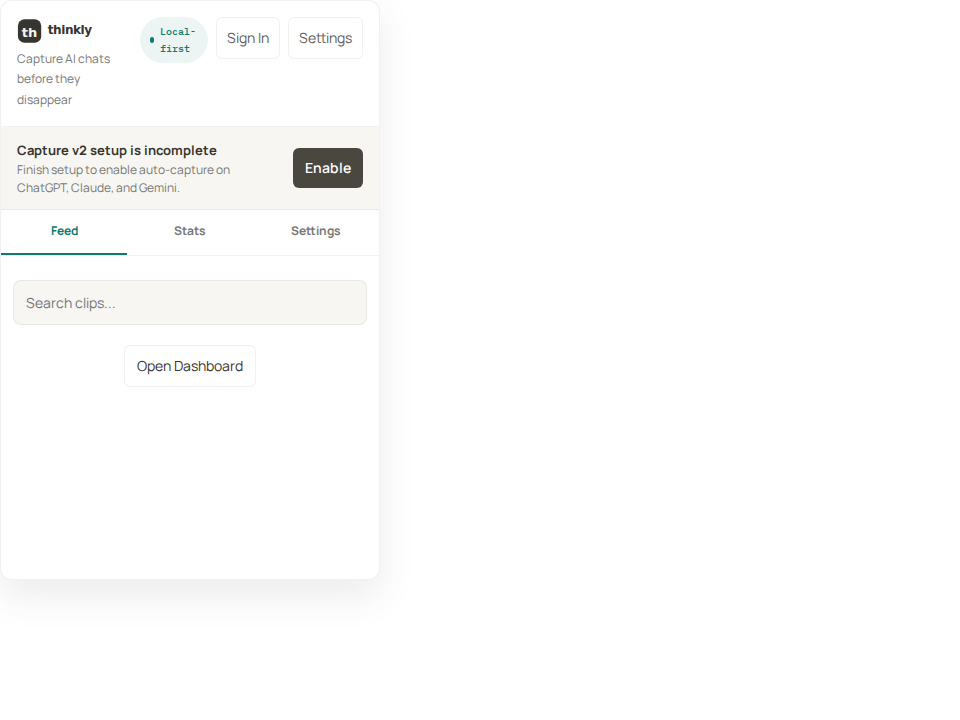
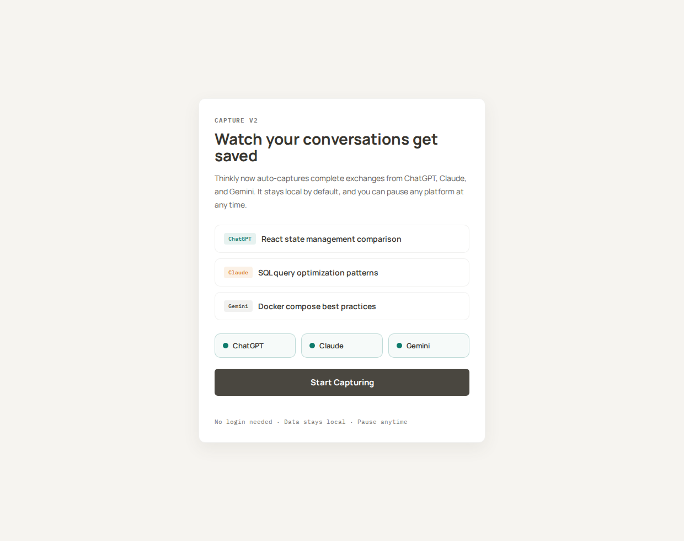
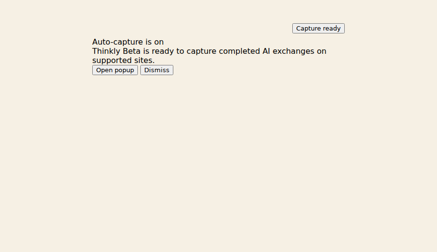

# Thinkly Chrome Extension Beta Preview

This branch is the public beta-preview surface for the Thinkly Chrome extension.

It is for:

- upcoming v2 foundation notes
- UI and onboarding preview screenshots
- beta release notes
- known gaps before a public installable beta

It is not for:

- stable installation
- Chrome Web Store upload assets
- load-unpacked developer builds

## Current status

- Preview-only beta branch
- Installable beta ZIP can be published only after generating it from the private monorepo with a separate beta extension key and a separate beta Google OAuth client
- Stable install instructions remain on the `main` branch

## Download beta ZIP

- [Download `thinkly-beta-v4.2.0-beta.18.zip`](https://github.com/pluglabai/thinkly-chrome-extension/raw/beta-preview/thinkly-beta-v4.2.0-beta.18.zip)
- Beta release notes: https://github.com/pluglabai/thinkly-chrome-extension/releases/tag/chrome-extension-beta-v4.2.0-beta.18

## What is changing in beta

The current beta focus is extension v2 foundation work:

- two-row selection action bar so Review, Export, and Delete stay readable in pinned mode
- Gemini now uses common ChatGPT-style DOM pairing instead of Gemini-only latest capture
- Claude capture supports split render containers and newer font-user-message structures
- Gemini broad fallback capture restored so missing role selectors still save visible exchanges
- Claude feedback-button action anchors improved for response capture
- Gemini and Claude auto-capture fixes for current production DOM structures
- broader Gemini/Claude capture selectors for chat-window, query, response, rendered-turn, and streaming containers
- explicit No chat found status when manual save cannot locate a provider chat turn
- clearer auto-capture status that shows local captures waiting for review
- extra reserved scroll space so bottom captures stay visible while selection actions are open
- stricter Gemini capture that saves only the latest role-bearing exchange and blocks broad page chrome
- Claude-specific capture using user-message and message-action anchors
- reviewed-only sync so only approved captures leave local storage
- accurate ChatGPT, Claude, and Gemini platform stats across local and synced clips
- floating contextual help across popup menus and actions
- Thinkly logo onboarding with animated AI example cards
- search result counts in the Feed when a query is active
- dismissible free AI organization CTA across Feed, Stats, and Settings
- GTM-focused onboarding and popup copy
- free AI organization sync CTA across Feed, Stats, and Settings
- Feed review filters for All, To review, and Reviewed captures
- checkbox-style selection with Mark reviewed, Review again, Delete, and Export actions
- fixed Local/Synced stats and broader Feed search across source metadata
- auto-capture action fixes for long-running ChatGPT responses
- Pause Capture, Save this turn, and Open Dashboard status actions now recover from stuck states
- auto-capture guardrails skip provider tips, privacy notices, and other non-chat page text
- Capture Coach status copy explains when to save selected text manually
- Quick Save remains local-first when post-save sync queueing fails
- side-panel spacing improved for pinned Chrome extension use
- category UI hidden from popup and Quick Save surfaces
- popup header alignment and compact Pin / Export actions
- Capture v2 setup banner persistence fix
- safer auto-capture timing for streaming AI answers
- popup shell refresh
- onboarding and settings foundation
- inline capture UI refresh
- status pill groundwork
- Gemini validation support
- main-world page bridge groundwork

## Stable branch

For the current stable public distribution surface, use:

- branch: `main`
- release tag: `chrome-extension-v4.1.0`

## Beta prerelease

- prerelease tag: `chrome-extension-beta-v4.2.0-beta.18`

This prerelease may contain preview docs and screenshots before an installable beta ZIP is attached.

## Preview screenshots

### Popup shell

### Onboarding

### Inline status pill

## Feedback

Until installable beta builds are published, feedback should be based on:

- release notes
- screenshots
- product walkthroughs
- direct coordination with the Thinkly team
